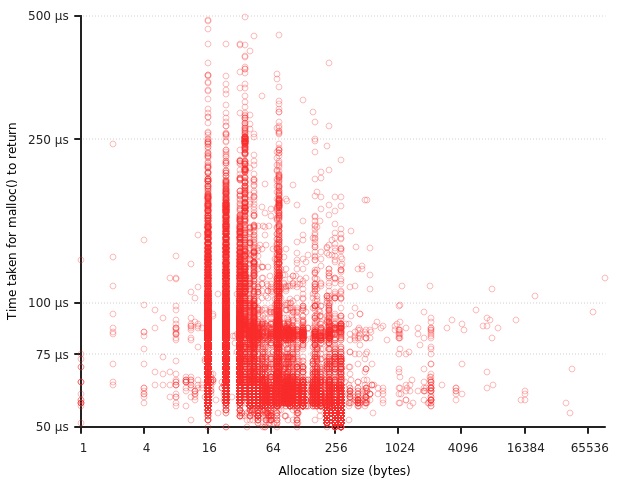

# Chapter 6: Particles

## Tracing memory allocations

### Getting data

`timeout 20 ltrace -T -o trace.txt -e "-*+malloc+free+realloc" ./target/debug/particles`

Converting to tab-separated values:

`sed 's/->/ /' trace.txt | sed 's/, /|/' | tr '()\><=' ' ' | column -t | tr -s ' ' '\t' > trace.tsv`

### Getting memory allocation times

`grep malloc trace.tsv | awk '{print $3,$5}' > allocs.tsv`

### Using gnuplot

Using the [script](./allocs.plot) from the book:

`gnuplot -p allocs.plot`

